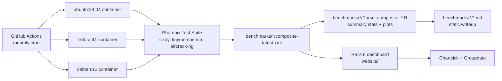

<picture>
  <source media="(prefers-color-scheme: dark)"  srcset="assets/banner-dark.svg"  type="image/svg+xml">
  <source media="(prefers-color-scheme: light)" srcset="assets/banner-light.svg" type="image/svg+xml">
  <source media="(prefers-color-scheme: dark)"  srcset="assets/banner-dark.png">
  <source media="(prefers-color-scheme: light)" srcset="assets/banner-light.png">
  
</picture>

[](https://github.com/Builder106/LinuxBenchHub/actions/workflows/ci.yml)
[](https://www.ruby-lang.org/)
[](https://rubyonrails.org/)
[](#license)
[](#project-status)

> A benchmarking dataset for Linux distros &mdash; run Phoronix Test Suite across identical hardware on Ubuntu, Fedora, and Debian, captured monthly in CI, with a Rails dashboard and R parsers consuming the same composite XML.

## What this is

LinuxBenchHub has three components:

1. **A benchmark dataset and analysis** under [`benchmarks/`](benchmarks/) &mdash; per-distro Phoronix Test Suite results (CPU, memory, network). Each distro has an R parsing script that extracts summary stats from the raw `pts/composite.xml`. The original bare-metal sample (VMware Fusion Pro on 2&times; i5-7360U) lives at the root of each distro folder; CI-captured runs land in `benchmarks/<distro>/captures/`.
2. **A capture pipeline** under [`.github/workflows/capture-benchmarks.yml`](.github/workflows/capture-benchmarks.yml) &mdash; a monthly GitHub Actions job that runs `pts/c-ray`, `pts/tinymembench`, and `pts/aircrack-ng` inside Ubuntu, Fedora, and Debian containers on the same `ubuntu-latest` runner, then commits the resulting `composite.xml` back to the repo. Free, reproducible, no cloud bill.
3. **A Rails 8 dashboard** under [`website/`](website/) &mdash; a web app that lists stored benchmarks, supports Devise auth, exports CSV/JSON, and renders charts with Chartkick. The dashboard reads the same `composite.xml` files the R scripts parse, so it stays in sync with whatever the CI workflow last captured.

## Sample results &mdash; Ubuntu 24.04

The fully parsed sample is Ubuntu 24.04 LTS on 2&times; Intel Core i5-7360U (3 cores), 4 GB RAM, 21 GB disk, in VMware Fusion Pro 13.6.1:

| Benchmark | Test | Metric | Mean | Median | StdDev |
| --- | --- | --- | --- | --- | --- |
| **C-Ray** (CPU) | `pts/c-ray-2.0.0`, 1080p @ 16 rpp | ms | 1,088.8 | 1,141.1 | 222.5 |
| **Tinymembench** (memcpy) | `pts/tinymembench-1.0.2` | MB/s | 11,209.5 | 11,873.6 | 2,761.1 |
| **Tinymembench** (memset) | `pts/tinymembench-1.0.2` | MB/s | 23,480.2 | 25,745.6 | 5,731.1 |
| **Aircrack-ng** (network) | `pts/aircrack-ng-1.3.0` | k/s | 4,542.6 | 4,943.1 | 835.1 |

Full per-run data and visualizations:

- [**`benchmarks/ubuntu/ubuntu.md`**](benchmarks/ubuntu/ubuntu.md) &mdash; Ubuntu 24.04
- [**`benchmarks/fedora/fedora.md`**](benchmarks/fedora/fedora.md) &mdash; Fedora Linux 41
- [**`benchmarks/debian/debian.md`**](benchmarks/debian/debian.md) &mdash; Debian 12

## How the pieces fit



The R parsers and the Rails app are interchangeable consumers of the same `composite.xml` &mdash; run the static analysis with R alone, or boot the dashboard alone, or both. The capture workflow doesn't care which one downstream uses the files.

## Repo layout

```
.
|-- benchmarks/              # captured Phoronix results, per distro
|   |-- ubuntu/              #   ubuntu.md + Parse_composite_Ubuntu.R + composite-latest.xml + captures/
|   |-- fedora/
|   `-- debian/
|-- .github/
|   |-- workflows/
|   |   |-- capture-benchmarks.yml   # monthly CI capture per distro
|   |   |-- ci.yml                    # Rails test suite gate
|   |   `-- deploy.yml                # Rails app deploy
|   `-- scripts/
|       `-- pts-batch-config.xml      # seeded into PTS before non-interactive runs
|-- site/                    # Next.js static showcase (deployed on Vercel)
|-- website/                 # Rails 8 dashboard
|   |-- app/                 #   models, controllers, views
|   |-- config/              #   routes, Whenever schedule
|   `-- Dockerfile           #   production image
|-- linux_benchmarking.rb    # standalone CLI script for ad-hoc runs
|-- .lintr                   # R linter config for the Parse_composite_*.R scripts
`-- assets/                  # banner + social card
```

## Setup

### Capturing fresh benchmarks

Captures happen automatically on the 1st of every month via [`.github/workflows/capture-benchmarks.yml`](.github/workflows/capture-benchmarks.yml). To trigger an out-of-band run, push the workflow's "Run workflow" button on the Actions tab &mdash; you can pick a single distro or all three. The job commits `composite-YYYY-MM-DD.xml` (a dated archive) and overwrites `composite-latest.xml` (the stable pointer the dashboard and R scripts read).

To re-derive the summary stats from a fresh `composite.xml` locally:

```bash
Rscript benchmarks/ubuntu/Parse_composite_Ubuntu.R benchmarks/ubuntu/composite-latest.xml
```

R deps: `xml2`, `dplyr`, `ggplot2`, `tidyr`. The `.lintr` at repo root pins the lint rules.

### Running the Rails dashboard

```bash
cd website
bundle install
bin/rails db:prepare
bin/rails server
```

The dashboard reads the same `composite.xml` files the R scripts parse. No external services required &mdash; SQLite is the only datastore.

Deployment is configured for **Kamal** &mdash; see [`website/.kamal/`](website/.kamal/) and [`website/Dockerfile`](website/Dockerfile). The Kamal config is the Rails 8 default scaffold with placeholder values; fill in `image`, `servers`, `proxy.host`, and `registry.username` before `bin/kamal setup`.

## Project status

The architecture pivoted from "on-demand Azure VMs per click" to "monthly CI captures into git." That trade dropped the live-VM demo but bought reproducibility, $0 ongoing cost, and a much smaller security surface (no SSH passwords, no public VNC ports, no cloud cleanup races).

- **Ubuntu 24.04 / Fedora 41 / Debian 12** &mdash; the bare-metal sample sits at the root of each `benchmarks/<distro>/`, captured once on VMware Fusion Pro. CI runs capture fresh containerized numbers monthly into `benchmarks/<distro>/captures/`.
- **Cross-distro comparison page** &mdash; the three writeups exist independently; a side-by-side comparison page is not yet written.
- **Rails dashboard** &mdash; scaffolded with Devise auth and Chartkick. Reads `composite.xml` directly. Expect rough edges &mdash; the most recent ingester rewrite is in flight.
- **Kamal deploy** &mdash; `deploy.yml` still has scaffold placeholders. Fill them in or pick a different host (Fly.io / Render both run the same Dockerfile).

## Tech stack

- **Benchmarks**: Phoronix Test Suite, R (`xml2`, `dplyr`, `ggplot2`, `tidyr`)
- **Capture**: GitHub Actions (monthly cron, distro containers on `ubuntu-latest`)
- **Dashboard**: Rails 8.0, Ruby 3.3, SQLite, Puma, Hotwire (Turbo + Stimulus), Bootstrap, Chartkick + Groupdate
- **Auth**: Devise
- **Deploy**: Docker + Kamal (or any Docker-host PaaS)

## License

Code released under the [MIT License](LICENSE). Third-party components retain their upstream licenses: **Phoronix Test Suite** is GPLv3 (referenced, not bundled); **noVNC**, embedded under [`website/noVNC/`](website/noVNC/), is MPL-2.0; Rails and Ruby are MIT. Captured Phoronix outputs under `benchmarks/*/` are derivative works of the upstream tests.
