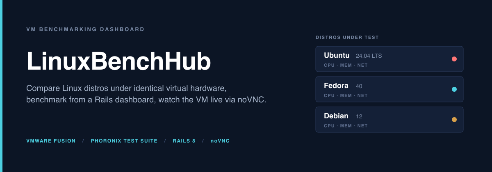
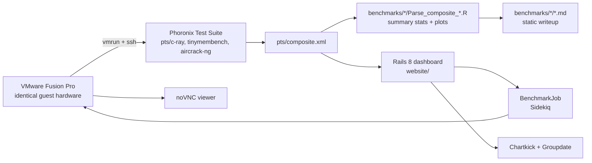

<picture>
  <source media="(prefers-color-scheme: dark)"  srcset="assets/banner-dark.png">
  <source media="(prefers-color-scheme: light)" srcset="assets/banner-light.png">
  
</picture>

[](https://github.com/Builder106/LinuxBenchHub/actions/workflows/ci.yml)
[](https://www.ruby-lang.org/)
[](https://rubyonrails.org/)
[](#license)
[](#project-status)

> A VM benchmarking platform for Linux distros &mdash; run Phoronix Test Suite across identical virtual hardware on Ubuntu, Fedora, and Debian, see the results in a Rails dashboard, and connect to the live VM through an embedded noVNC viewer.

## What this is

LinuxBenchHub has two components:

1. **A benchmark dataset and analysis** under [`benchmarks/`](benchmarks/) &mdash; per-distro Phoronix Test Suite results (CPU, memory, network) captured from VMware Fusion VMs running on identical synthetic hardware. Each distro has an R parsing script that extracts the composite numbers from the raw `pts/*` test output.
2. **A Rails 8 dashboard** under [`website/`](website/) &mdash; a web app that lists stored benchmarks, lets you start a new benchmark on a fresh VM via a background `BenchmarkJob`, embeds noVNC so you can watch the VM while it runs, and renders charts with Chartkick.

Both pieces speak the same data shape: the Rails app's database is hydrated from the same `pts/composite.xml` files the R scripts parse for the static markdown.

## Sample results &mdash; Ubuntu 24.04

The fully parsed sample is Ubuntu 24.04 LTS on 2&times; Intel Core i5-7360U (3 cores), 4 GB RAM, 21 GB disk, in VMware Fusion Pro 13.6.1:

| Benchmark | Test | Metric | Mean | Median | StdDev |
| --- | --- | --- | --- | --- | --- |
| **C-Ray** (CPU) | `pts/c-ray-2.0.0`, 1080p @ 16 rpp | ms | 1,088.8 | 1,141.1 | 222.5 |
| **Tinymembench** (memcpy) | `pts/tinymembench-1.0.2` | MB/s | 11,209.5 | 11,873.6 | 2,761.1 |
| **Tinymembench** (memset) | `pts/tinymembench-1.0.2` | MB/s | 23,480.2 | 25,745.6 | 5,731.1 |
| **Aircrack-ng** (network) | `pts/aircrack-ng-1.3.0` | k/s | 4,542.6 | 4,943.1 | 835.1 |

Full per-run data and visualizations: [**`benchmarks/ubuntu/ubuntu.md`**](benchmarks/ubuntu/ubuntu.md). Fedora and Debian raw `pts/*` outputs are captured but the per-distro markdown writeups are in progress &mdash; see [Project status](#project-status).

## How the pieces fit



The R parsers and the Rails ingester are interchangeable consumers of the same `pts/composite.xml` &mdash; you can run the static analysis with R alone if you don't want the dashboard, or use the dashboard alone if you don't care about scripted plots.

## Repo layout

```
.
|-- benchmarks/              # captured Phoronix results, per distro
|   |-- ubuntu/              #   ubuntu.md + Parse_composite_Ubuntu.R + CPU/Memory/Network
|   |-- fedora/
|   `-- debian/
|-- website/                 # Rails 8 dashboard (separate Gemfile, deployable via Kamal)
|   |-- app/                 #   models, controllers, views, jobs
|   |-- config/              #   routes, Sidekiq, Whenever cron
|   |-- noVNC/               #   embedded noVNC for live VM view
|   `-- Dockerfile           #   production image
|-- linux_benchmarking.rb    # standalone CLI script for ad-hoc runs
|-- .lintr                   # R linter config for the Parse_composite_*.R scripts
`-- assets/                  # banner + social card
```

## Setup

### Re-running the static benchmarks

Each distro VM needs Phoronix Test Suite installed; the workflow per distro is documented in its `benchmarks/<distro>/<distro>.md`. To re-derive the summary stats from a fresh `pts/composite.xml`:

```bash
Rscript benchmarks/ubuntu/Parse_composite_Ubuntu.R path/to/composite.xml
```

R deps: `xml2`, `dplyr`, `ggplot2`, `tidyr`. The `.lintr` at repo root pins the lint rules I use.

### Running the Rails dashboard

```bash
cd website
bundle install
yarn install                       # importmap is preferred; only needed if using packs
bin/rails db:prepare
bin/rails server
```

You'll also want **Sidekiq** running for the background `BenchmarkJob`:

```bash
bundle exec sidekiq
```

The app expects VMware Fusion Pro and `vmrun` on the host. The `BenchmarkJob` uses `vmrun` to start a VM, SSHs in to invoke Phoronix, polls for completion, then ingests the composite XML on the Rails side.

Deployment is configured for **Kamal** &mdash; see `website/.kamal/`. Production runtime is a Docker image (`website/Dockerfile`) talking to SQLite locally and Azure managed compute for remote VM pools (`azure_mgmt_*` gems).

## Project status

This is a mid-build project; pieces work in isolation but the end-to-end "click benchmark, watch the VM run, see the chart" loop is not stable across all three distros. Specifically:

- **Ubuntu 24.04**: full benchmark capture and the R parser are working. The published numbers above are real.
- **Fedora 40 / Debian 12**: raw `pts/*` runs are captured but the per-distro markdown writeups are stubs. The R parsers are written but not run against the new composites.
- **Rails dashboard**: scaffolded with Devise auth, Sidekiq jobs, Chartkick charts, and the embedded noVNC viewer. The latest commit on `main` is `Trying to fix this`; expect rough edges, broken paths, and at least one half-merged feature branch.
- **Kamal deploy**: configured but not currently pointing at a live host.

If you want the experience the README banner is selling, the static Ubuntu writeup + R parsers is the bit to read; the Rails app is a snapshot of where the project was headed, not a finished product.

## Tech stack

- **Benchmarks**: Phoronix Test Suite, VMware Fusion Pro 13.6.1, R (`xml2`, `dplyr`, `ggplot2`)
- **Dashboard**: Rails 8.0, Ruby 3.3, SQLite, Puma, Hotwire (Turbo + Stimulus), Bootstrap
- **Background work**: Sidekiq, Whenever (cron)
- **Charts**: Chartkick + Groupdate
- **Auth**: Devise
- **Live VM view**: embedded noVNC over WebSocket
- **Cloud**: Azure SDK for Ruby (`azure_mgmt_compute`, `azure_mgmt_network`, `azure_mgmt_resources`)
- **Deploy**: Docker + Kamal

## License

Code released under the [MIT License](LICENSE). Captured Phoronix Test Suite outputs under `benchmarks/*/` are derivative works of the upstream Phoronix tests; Phoronix Test Suite itself is GPLv3 and is not included.
