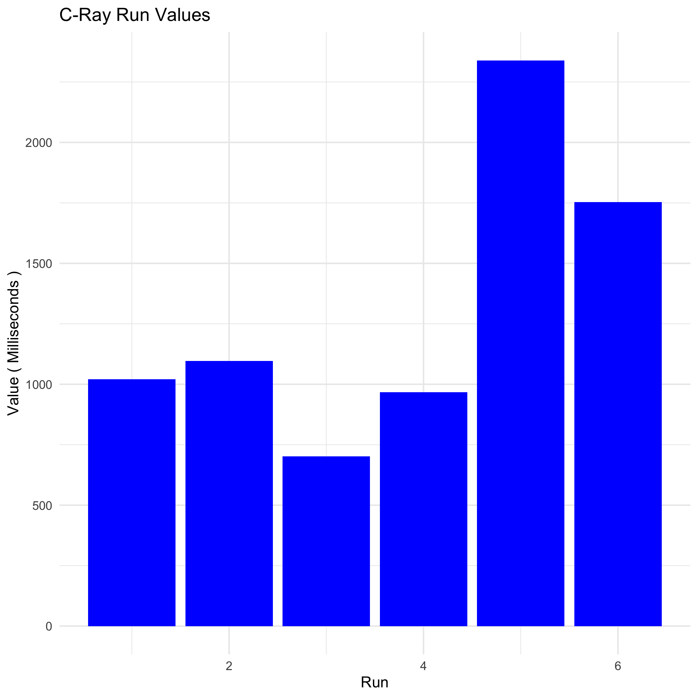
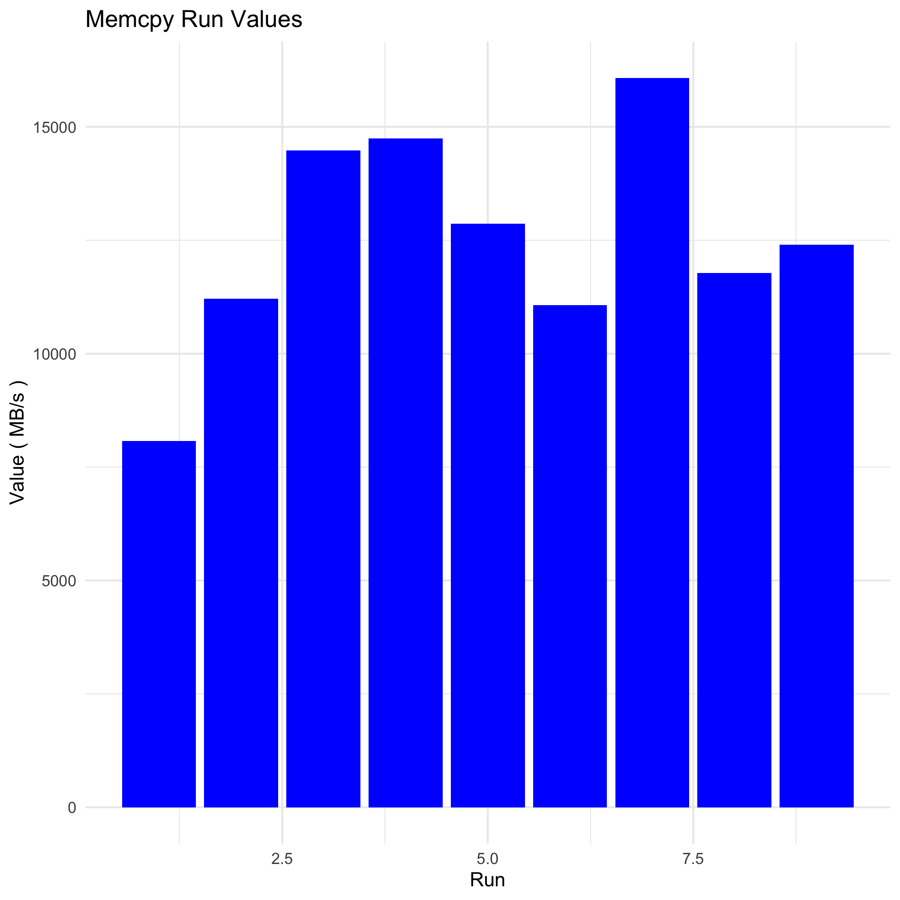
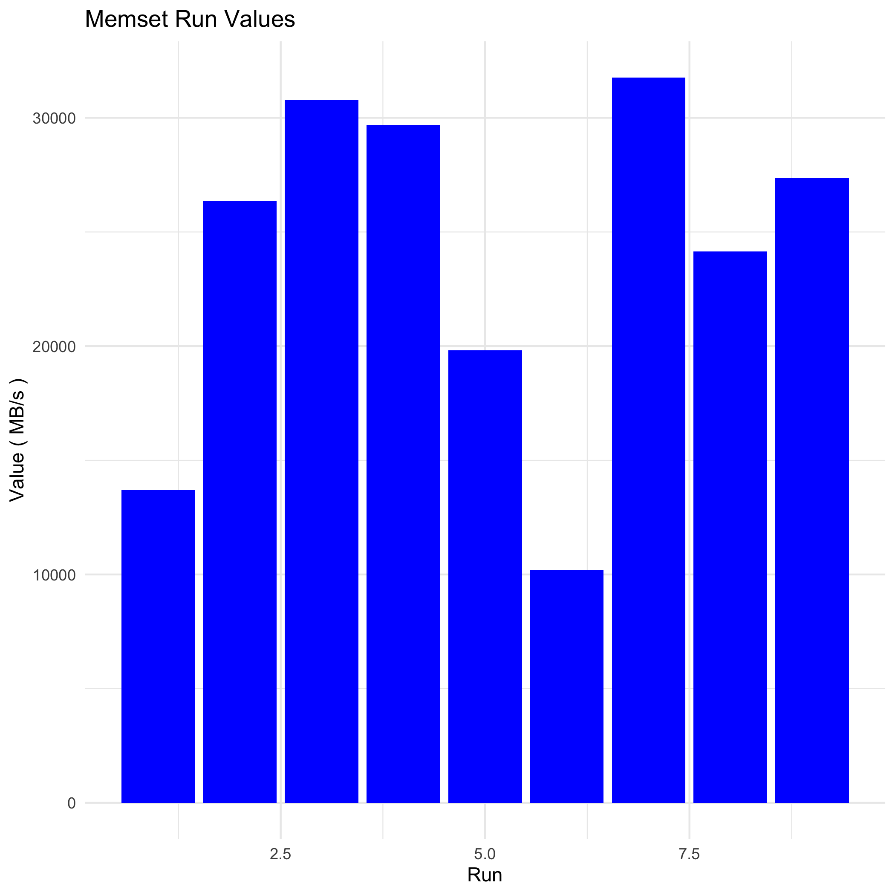
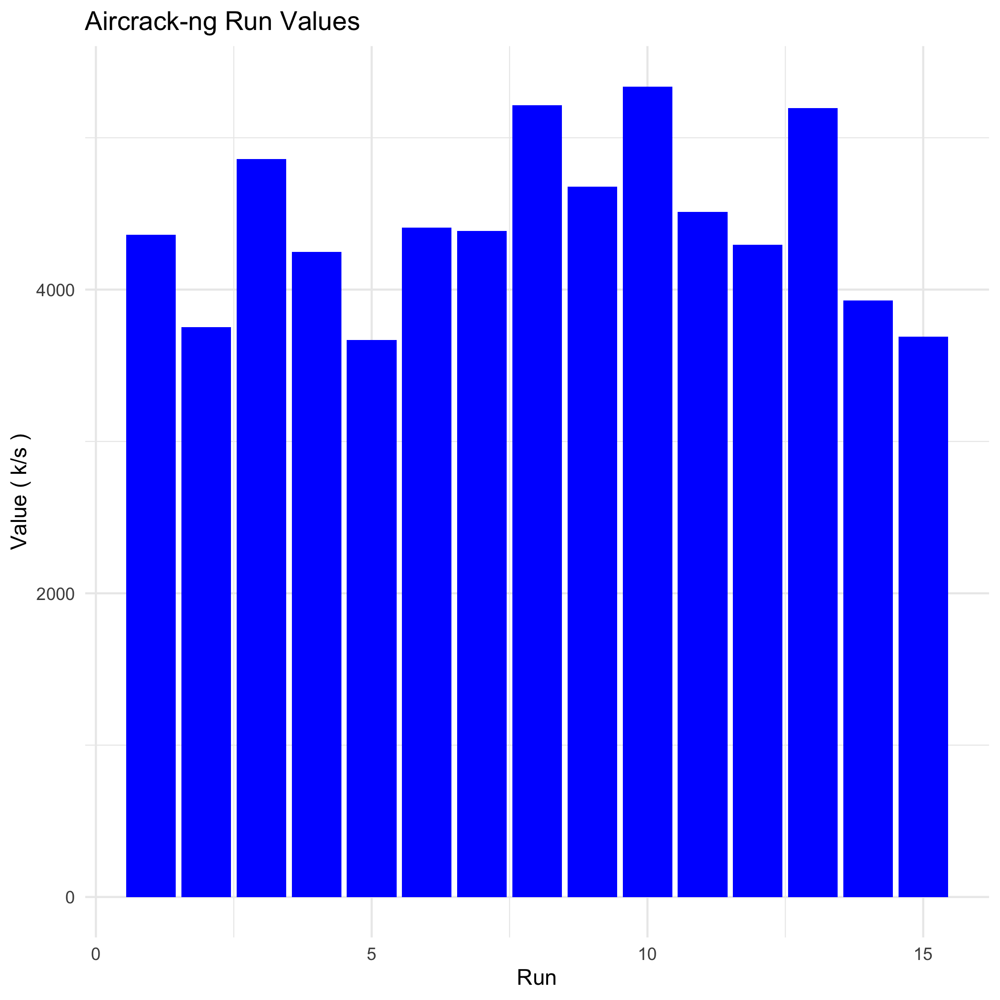

# Debian Benchmark Results

This document provides detailed benchmarking results for Debian 12 running in a VMware Fusion Pro 13.6.1 virtual machine. The benchmarks were conducted using the Phoronix Test Suite v10.8.5.

## Table of Contents
1. [System Information](#system-information)
2. [C-Ray Benchmark](#c-ray-benchmark)
3. [Tinymembench Benchmark](#tinymembench-benchmark)
4. [Aircrack-ng Benchmark](#aircrack-ng-benchmark)

## System Information

### Hardware
- **Processor**: 2 x Intel Core i5-7360U (3 Cores)
- **Motherboard**: Intel VMware Virtual 440BX Desktop (6.00 BIOS)
- **Chipset**: Intel 440BX/ZX/DX
- **Memory**: 4096MB
- **Disk**: 21GB VMware Virtual S
- **Graphics**: llvmpipe
- **Audio**: Ensoniq ES1371/ES1373
- **Network**: Intel 82545EM

### Software
- **OS**: Debian 12
- **Kernel**: 6.1.0-28-amd64 (x86_64)
- **Desktop**: GNOME Shell 43.9
- **Display Server**: X Server + Wayland
- **OpenGL**: 4.5 Mesa 22.3.6 (LLVM 15.0.6 256 bits)
- **Compiler**: GCC 12.2.0
- **File-System**: ext4
- **Screen Resolution**: 1440x900
- **System Layer**: VMware

---

## C-Ray Benchmark

### Test Identifier: `pts/c-ray-2.0.0`

#### Title: C-Ray
- **App Version**: 2.0
- **Arguments**: `-s 1920x1080 -r 16`
- **Description**: Resolution: 1080p - Rays Per Pixel: 16
- **Scale**: Seconds
- **Display Format**: BAR_GRAPH

### Data Entries
- **Identifier**: cpu
- **Value (Seconds)**: 1312.860
- **Raw String (Milliseconds)**: `1020.504:1095.963:701.908:966.567:2339.107:1753.113`

### Detailed Run Times

| Run | Time (ms) |
|-----|-----------|
| 1   | 1020.504  |
| 2   | 1095.963  |
| 3   | 701.908   |
| 4   | 966.567   |
| 5   | 2339.107  |
| 6   | 1753.113  |

### Visualization

### Summary Statistics
- **Mean Time (ms)**: 1312.860
- **Median Time (ms)**: 1058.234
- **Standard Deviation (ms)**: 611.997

---

## Tinymembench Benchmark

### Test Identifier: `pts/tinymembench-1.0.2`

#### Title: Tinymembench
- **App Version**: 2018-05-28
- **Arguments**: 
- **Description**: Standard Memcpy
- **Scale**: MB/s
- **Display Format**: BAR_GRAPH

### Data Entries
- **Identifier**: Memory
- **Value (MB/s)**: 12522.3
- **Raw String (MB/s)**: `8072.1:11211.2:14475.8:14748.8:12863.4:11070.8:16079.8:11774.3:12404.9`

### Detailed Run Values

| Run | Value (MB/s) |
|-----|--------------|
| 1   | 8072.1       |
| 2   | 11211.2      |
| 3   | 14475.8      |
| 4   | 14748.8      |
| 5   | 12863.4      |
| 6   | 11070.8      |
| 7   | 16079.8      |
| 8   | 11774.3      |
| 9   | 12404.9      |

### Visualization

### Summary Statistics
- **Mean Value (MB/s)**: 12522.3
- **Median Value (MB/s)**: 12404.9
- **Standard Deviation (MB/s)**: 2391.4

### Test Identifier: `pts/tinymembench-1.0.2`

#### Title: Tinymembench
- **App Version**: 2018-05-28
- **Arguments**: 
- **Description**: Standard Memset
- **Scale**: MB/s
- **Display Format**: BAR_GRAPH

### Data Entries
- **Identifier**: Memory
- **Value (MB/s)**: 23759.5
- **Raw String (MB/s)**: `13694.7:26356.9:30795.2:29693.7:19817.6:10198.6:31767.8:24155.3:27355.5`

### Detailed Run Values

| Run | Value (MB/s) |
|-----|--------------|
| 1   | 13694.7      |
| 2   | 26356.9      |
| 3   | 30795.2      |
| 4   | 29693.7      |
| 5   | 19817.6      |
| 6   | 10198.6      |
| 7   | 31767.8      |
| 8   | 24155.3      |
| 9   | 27355.5      |

### Visualization

### Summary Statistics
- **Mean Value (MB/s)**: 23759.5
- **Median Value (MB/s)**: 26356.9
- **Standard Deviation (MB/s)**: 7660.1

---

## Aircrack-ng Benchmark

### Test Identifier: `pts/aircrack-ng-1.3.0`

#### Title: Aircrack-ng
- **App Version**: 1.7
- **Arguments**: 
- **Description**: 
- **Scale**: k/s
- **Display Format**: BAR_GRAPH

### Data Entries
- **Identifier**: Network
- **Value (k/s)**: 4435.712
- **Raw String (k/s)**: `4360.701:3753.158:4860.243:4248.137:3668.458:4408.846:4386.761:5215.227:4679.17:5337.363:4512.018:4294.092:5194.021:3928.565:3688.927`

### Detailed Run Values

| Run | Value (k/s) |
|-----|-------------|
| 1   | 4360.701    |
| 2   | 3753.158    |
| 3   | 4860.243    |
| 4   | 4248.137    |
| 5   | 3668.458    |
| 6   | 4408.846    |
| 7   | 4386.761    |
| 8   | 5215.227    |
| 9   | 4679.170    |
| 10  | 5337.363    |
| 11  | 4512.018    |
| 12  | 4294.092    |
| 13  | 5194.021    |
| 14  | 3928.565    |
| 15  | 3688.927    |

### Visualization

### Summary Statistics
- **Mean Value (k/s)**: 4435.712
- **Median Value (k/s)**: 4386.761
- **Standard Deviation (k/s)**: 546.1
