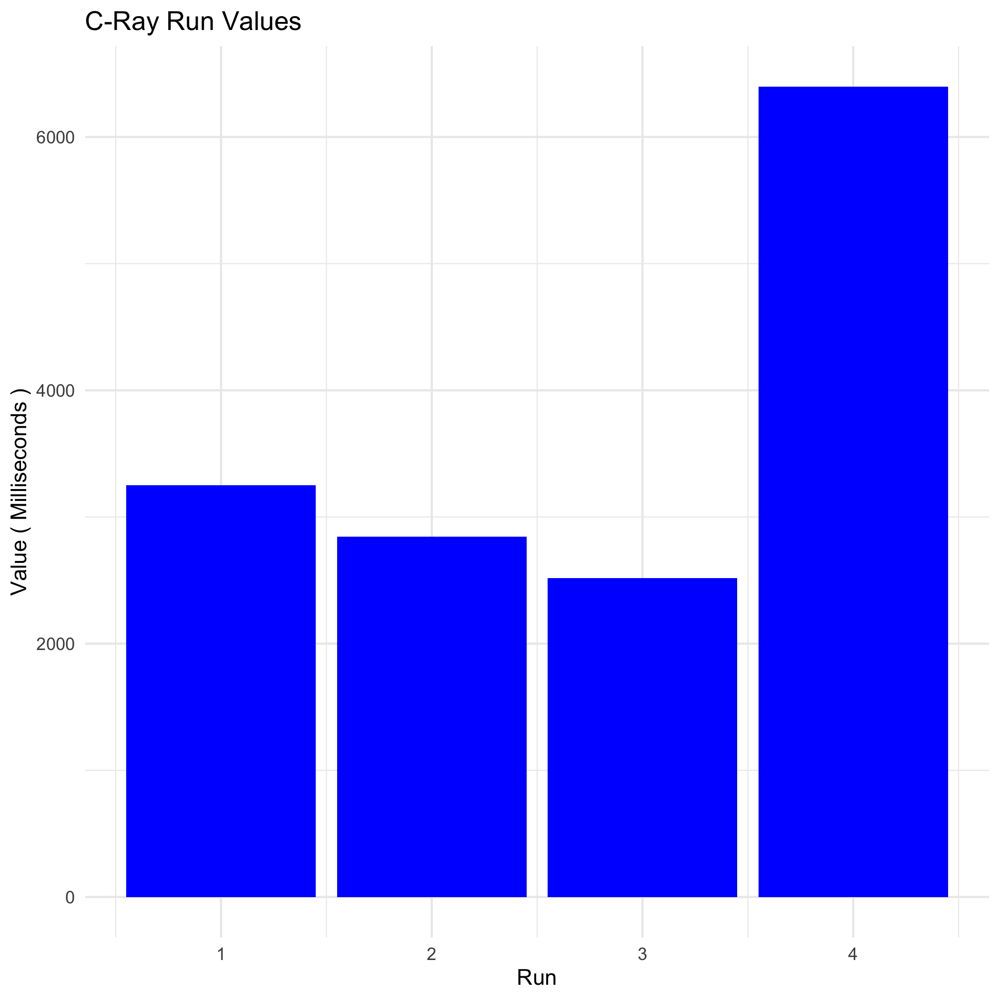
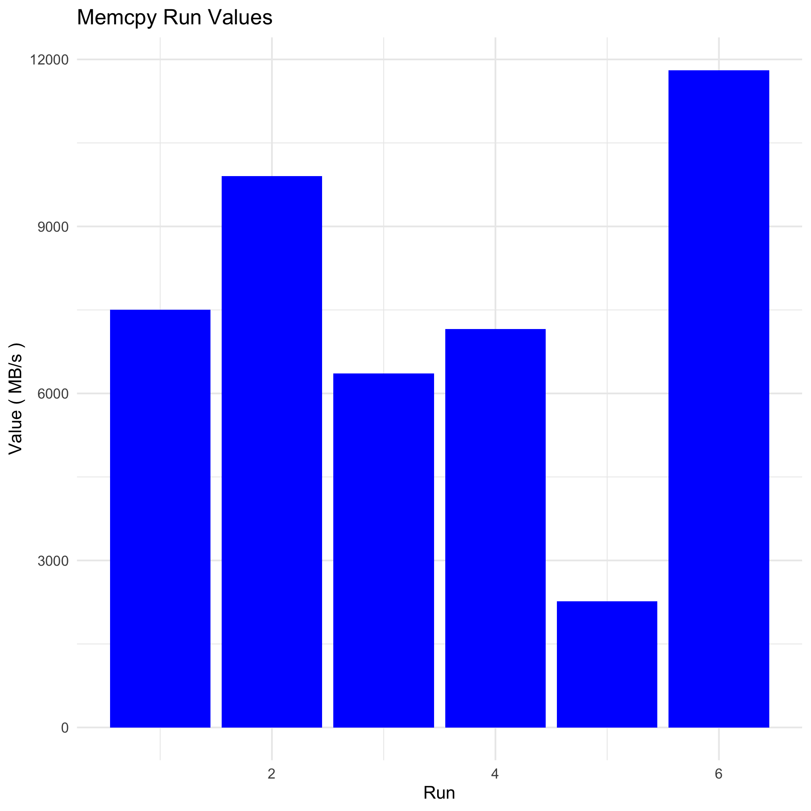
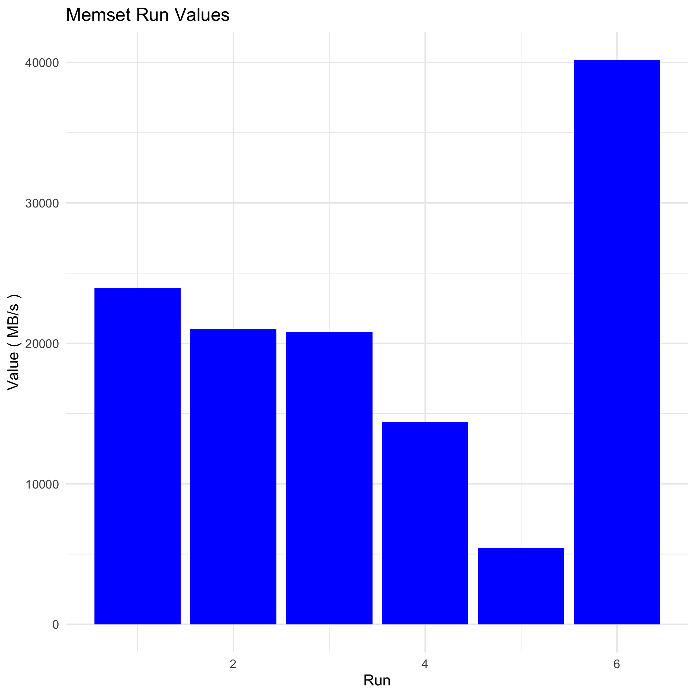
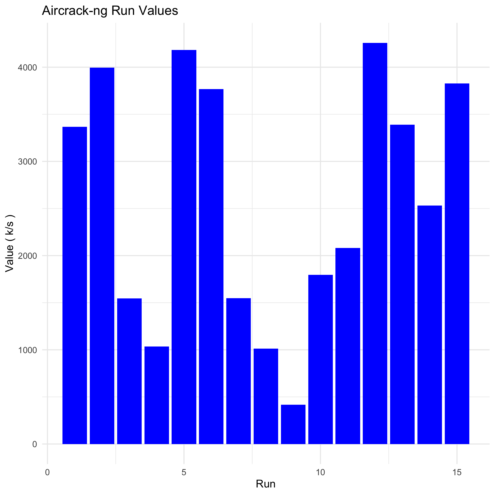

# Fedora Benchmark Results

This document provides detailed benchmarking results for Fedora Linux 41 running in a VMware Fusion Pro 13.6.1 virtual machine. The benchmarks were conducted using the Phoronix Test Suite v10.8.4.

## Table of Contents
1. [System Information](#system-information)
2. [C-Ray Benchmark](#c-ray-benchmark)
3. [Tinymembench Benchmark](#tinymembench-benchmark)
4. [Aircrack-ng Benchmark](#aircrack-ng-benchmark)

## System Information

### Hardware
- **Processor**: 2 x Intel Core i5-7360U (3 Cores)
- **Motherboard**: Intel 440BX (6.00 BIOS)
- **Chipset**: Intel 440BX/ZX/DX
- **Memory**: 4096MB
- **Disk**: 21GB VMware Virtual NVMe Disk
- **Graphics**: SVGA3D; build: RELEASE; LLVM
- **Audio**: Ensoniq ES1371/ES1373
- **Network**: VMware VMXNET3

### Software
- **OS**: Fedora Linux 41
- **Kernel**: 6.12.5-200.fc41.x86_64 (x86_64)
- **Desktop**: GNOME Shell 47.2
- **Display Server**: X Server + Wayland
- **OpenGL**: 4.3 Mesa 24.2.8
- **Compiler**: GCC 14.2.1 20240912
- **File-System**: btrfs
- **Screen Resolution**: 1440x900
- **System Layer**: VMware

---

## C-Ray Benchmark

### Test Identifier: `pts/c-ray-2.0.0`

#### Title: C-Ray
- **App Version**: 2.0
- **Arguments**: `-s 1920x1080 -r 16`
- **Description**: Resolution: 1080p - Rays Per Pixel: 16
- **Scale**: Seconds
- **Display Format**: BAR_GRAPH

### Data Entries
- **Identifier**: CPU
- **Value (Seconds)**: 3753.197
- **Raw String (Milliseconds)**: `3252.045:2844.444:2517.904:6398.393`

### Detailed Run Times

| Run | Time (ms) |
|-----|-----------|
| 1   | 3252.045  |
| 2   | 2844.444  |
| 3   | 2517.904  |
| 4   | 6398.393  |

### Visualization

### Summary Statistics
- **Mean Time (ms)**: 3753.197
- **Median Time (ms)**: 3048.244
- **Standard Deviation (ms)**: 1788.854

> **Note**: this capture has only 4 runs and includes a 6,398 ms outlier roughly 2&times; the others &mdash; the resulting mean is ~3.5&times; slower than Ubuntu/Debian on the same hardware, which is much larger than the cross-distro variance you'd expect on identical VM hardware. A re-run with the standard 9-run sample (matching Ubuntu's C-Ray capture) is needed before this number can be compared against the other two distros.

---

## Tinymembench Benchmark

### Test Identifier: `pts/tinymembench-1.0.2`

#### Title: Tinymembench
- **App Version**: 2018-05-28
- **Arguments**: 
- **Description**: Standard Memcpy
- **Scale**: MB/s
- **Display Format**: BAR_GRAPH

### Data Entries
- **Identifier**: Memory
- **Value (MB/s)**: 7500.0
- **Raw String (MB/s)**: `7505.5:9903.4:6362:7153.7:2268.7:11806.9`

### Detailed Run Values

| Run | Value (MB/s) |
|-----|--------------|
| 1   | 7505.5       |
| 2   | 9903.4       |
| 3   | 6362.0       |
| 4   | 7153.7       |
| 5   | 2268.7       |
| 6   | 11806.9      |

### Visualization

### Summary Statistics
- **Mean Value (MB/s)**: 7500.0
- **Median Value (MB/s)**: 7329.6
- **Standard Deviation (MB/s)**: 3259.1

### Test Identifier: `pts/tinymembench-1.0.2`

#### Title: Tinymembench
- **App Version**: 2018-05-28
- **Arguments**: 
- **Description**: Standard Memset
- **Scale**: MB/s
- **Display Format**: BAR_GRAPH

### Data Entries
- **Identifier**: Memory
- **Value (MB/s)**: 20959.0
- **Raw String (MB/s)**: `23921.2:21045.1:20835.6:14374.6:5418.5:40159`

### Detailed Run Values

| Run | Value (MB/s) |
|-----|--------------|
| 1   | 23921.2      |
| 2   | 21045.1      |
| 3   | 20835.6      |
| 4   | 14374.6      |
| 5   | 5418.5       |
| 6   | 40159.0      |

### Visualization

### Summary Statistics
- **Mean Value (MB/s)**: 20959.0
- **Median Value (MB/s)**: 20940.35
- **Standard Deviation (MB/s)**: 11509.1

---

## Aircrack-ng Benchmark

### Test Identifier: `pts/aircrack-ng-1.3.0`

#### Title: Aircrack-ng
- **App Version**: 1.7
- **Arguments**: 
- **Description**: 
- **Scale**: k/s
- **Display Format**: BAR_GRAPH

### Data Entries
- **Identifier**: Network
- **Value (k/s)**: 2583.807
- **Raw String (k/s)**: `3366.086:3995.059:1546.067:1036.266:4181.792:3768.339:1548.055:1013.703:417.03:1796.448:2080.258:4258.446:3389.998:2532.427:3827.127`

### Detailed Run Values

| Run | Value (k/s) |
|-----|-------------|
| 1   | 3366.086    |
| 2   | 3995.059    |
| 3   | 1546.067    |
| 4   | 1036.266    |
| 5   | 4181.792    |
| 6   | 3768.339    |
| 7   | 1548.055    |
| 8   | 1013.703    |
| 9   | 417.030     |
| 10  | 1796.448    |
| 11  | 2080.258    |
| 12  | 4258.446    |
| 13  | 3389.998    |
| 14  | 2532.427    |
| 15  | 3827.127    |

### Visualization

### Summary Statistics
- **Mean Value (k/s)**: 2583.807
- **Median Value (k/s)**: 2532.427
- **Standard Deviation (k/s)**: 1313.2
